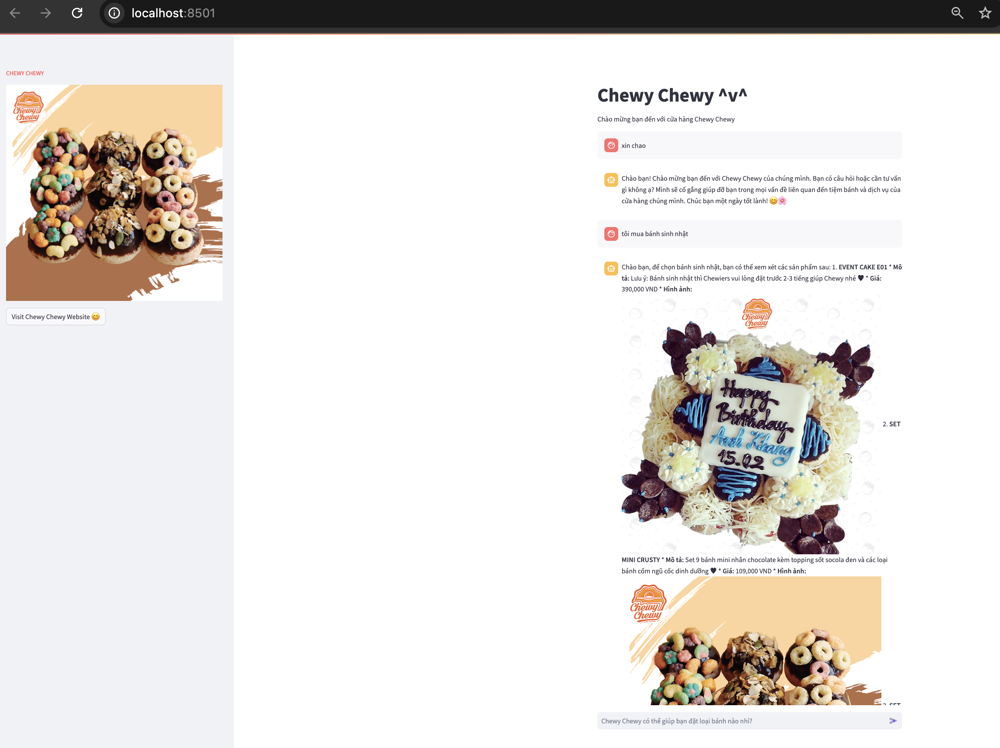

**CHEWY CHEWY RAG-BOT-DEMO** 

[Hướng dẫn các bước xây dựng bot](https://drive.google.com/drive/u/0/folders/1vVmE6Q3NECtiF-RNPCquI_hsMaoTiDYp)


How to run code:

- Run with conda

Tested with:

- Conda version 23.10.0

Run command:

```python
conda create --name rag_bot_protonX python=3.11 

conda activate rag_bot_protonX

pip install -r requirements.txt

streamlit run chatbot_main.py --server.port=8501

python flask_serve.py
```

Result:




